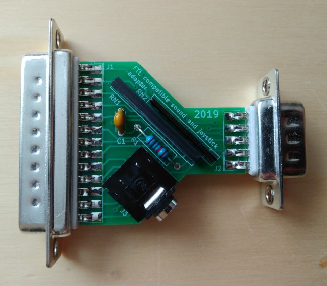

# Parallel port audio and joystick adapter

These are KiCAD and Inkscape design files for an improved FTL Sound Adapter compatible parallel port audio and joystick adapter.

This particular design adds series resistors to prevent a joystick connected to the expansion port from shorting out parallel port lines.

## Photo

## License

This work is licensed under the Creative Commons Attribution-ShareAlike 4.0 International License. To view a copy of this license, visit http://creativecommons.org/licenses/by-sa/4.0/ or send a letter to Creative Commons, PO Box 1866, Mountain View, CA 94042, USA.
